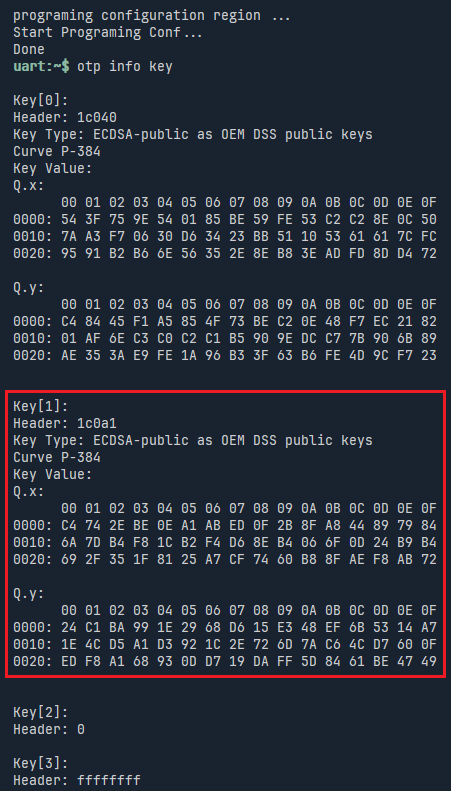
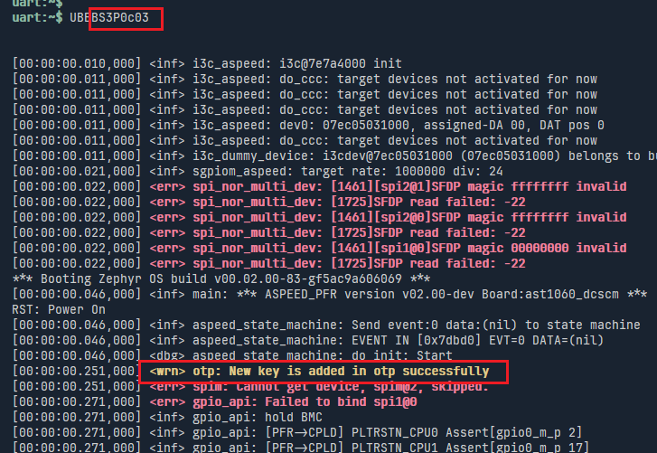
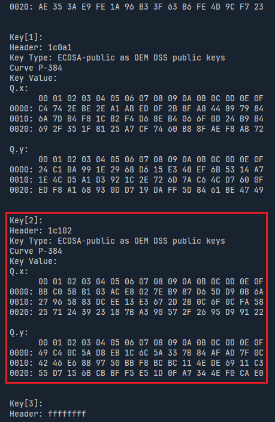
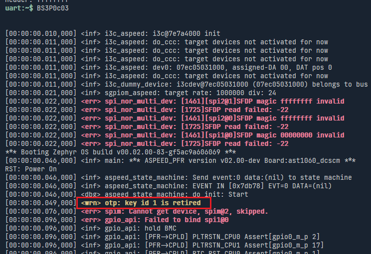
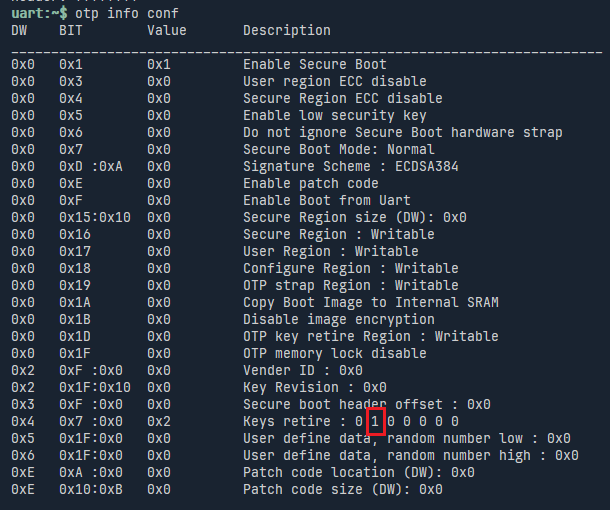

# Ownership Transfer in PFR Firmware

PFR Firmware supports the following ownership transfer steps:

1. Power on by owner A
2. FW1 (signed by key A) is updated to FW2 (signed by key A)
3. Power cycle by owner A
4. FW2 (signed by key A) writes public key B to OTP regions
5. Power off and transfer to owner B
6. Power on by owner B
7. FW2 (signed by key A) is updated to FW3 (signed by key B)
8. Power cycle by owner B
9. FW3 (signed by key B) retires key A.

For doing ownership transfer, it requires 3 kind of firmware images.
- FW1 (signed by key A) : The initial firmware.
- FW2 (signed by key A) : The firmware contains an embedded public key B.
- FW3 (signed by key B) : For retiring key A.

### Generate OTP Image

Before updating FW2, secure boot and keyA should already be added in OTP, both signed FW1 and FW2 are verified by KeyA.
The first key(KeyA) usually be added by programming OTP image into ast1060's otp region.  
Please makesure the otp generation command contains `--no_last_bit`, otherwise, new key can't be added in otp region.

For example:
```
otptool make_otp_image ./otp/config/ast1060a2_ecdsa384.json --no_last_bit --key_folder ./otp/keys/ --output_folder ./output/
```


### Generate FW2

FW2 is used to add owner B's publick key in otp region.
User should enable **CONFIG_OTP_KEY_ADD** and put public key in otp_key.c

- in aspeed-zephyr-project/apps/aspeed-pfr/prj.conf

  ```
  CONFIG_OTP_ASPEED=y
  # Optional : Enable OTP shell commands
  CONFIG_SHELL_CMDS_OTP=y
  CONFIG_OTP_KEY_ADD=y
  ```

- in apps/aspeed-pfr/src/otp/otp_key.c , set the following varibles per your key type.
  It is the **Public Key B** to be written in otp.

  ```c
  // Example of ECDSA384 OEM DSS key 2 :
  uint8_t otp_header_slot = 2;                   // 0-based
  uint8_t otp_key_id = 2;                        // 0-based
  uint8_t otp_key_type = OTP_ECDSA384_PUBKEY;
  uint8_t otp_key_param = OTP_KPARAM_ECDSA384;
  uint16_t otp_key_exp_len = 0;
  uint32_t otp_key_offset = 0x100;               // otp data region offset for storing key
  uint32_t otp_key_len = 0x60;
  const uint8_t otp_pub_key[] = {
   	0xbb, 0xc0, 0x5b, 0xb1, 0x03, 0xac, 0xe8, 0x02,
   	0x7e, 0xb9, 0x87, 0xd6, 0x5d, 0xd9, 0x0b, 0x6a,
      ...
   	0x1d, 0x0f, 0xa7, 0x34, 0x4e, 0xf0, 0xca, 0xe0,
  };

  ```

- Sign the firmware with key A

  ```
  socsec make_secure_bl1_image --soc 1060 --algorithm ECDSA384 --bl1_image ./zephyr.bin --output ./zephyr_fw2.signed.bin --ecdsa_sign_key ./tools/owner_xfer/ecdsa384_1.pem
  ```

### Generate FW3

FW3 is used to retire key A
User should enable **CONFIG_OTP_KEY_RETIRE** to enable key retirement.

- in aspeed-zephyr-project/apps/aspeed-pfr/prj.conf

  ```
  CONFIG_OTP_ASPEED=y
  CONFIG_SHELL_CMDS_OTP=y
  CONFIG_OTP_KEY_ADD=n
  CONFIG_OTP_KEY_RETIRE=y
  ```

- in apps/aspeed-pfr/src/otp/otp_key.c , set `otp_retire_key_id` under `CONFIG_OTP_KEY_RETIRE`

  ```c
  #if defined(CONFIG_OTP_KEY_RETIRE)
  int32_t otp_retire_key_id = 1;  // valid range : 0 - 7
  ...
  #elif defined(CONFIG_OTP_KEY_ADD)
  ```

- Sign the firmware with key B
  ```
  socsec make_secure_bl1_image --soc 1060 --algorithm ECDSA384 --bl1_image ./zephyr.bin --output ./zephyr_fw3.signed.bin --ecdsa_sign_key ./tools/owner_xfer/ecdsa384_2.pem

  ```

### Demo Flow

In the below example, the sample keys are put in apps/aspeed-pfr/tools/owner_xfer/keys, and otp shell are enabled in all demo firmware.

1. Check otp key info in the initial firmware by `otp info key`, the current key is key[1]

2. Update firmware 2(Signed by ecdsa384_1.pem)
3. Bootup firmware 2, it add public key B(ecdsa384_2.pub.pem) in otp, the console shows **New key is added in otp successfully**

4. Issue `otp info key` in ast1060 console, it shows the **new key(ecdsa384_2.pub.pem) is added in key[2]**

5. Update firmware 3(Signed by ecdsa384_2.pem)
6. Bootup firmware 3, **it retires key A**(key[1]), the console shows **key id 1 is retired**

7. Issue `otp info conf` in ast1060 console, it shows key id 1 is retired.

